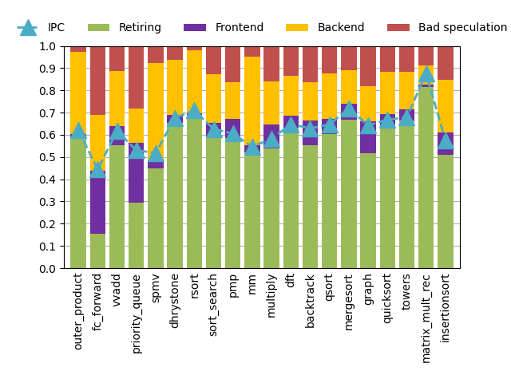

# RISC-V PMU project

Hello! This is the repository containing our work done enhancing the PMU on various open-source RISC-V cores. If you are reading this as a standalone PDF, you can visit the [GitHub repository](https://github.com/mattweingarten/riscv-pmu-core) for all our code. The goal of you going through this process is to check that when you modify either the code running on the core or the core architecture itself, the CPI numbers for the components undergo corresponding changes. If you want to experiment, you can modify the benchmarks in the `benchmarks` directory or dive into the RTL in either the `ibex` directory or `chipyard/generators/rocket-chip/src/main/scala/rocket`.

## Collaborators

Matt Weingarten (mew2260)
Michael Grieco (mag2346)
Prathmesh Patel (pp2870)

# For Artifact evaluation

To evaluate our artifact detailed instructions are included in this README.

<ol>
  <li>To download and install, follow <a href="#general-setup">General Setup</a>.</li>

  <li>All the RocketCore results can be replicated, including generating the plots. The steps are outlined in <a href="#rocket-core-simulation">RocketCore Simulation</a>.</li>

  <li>The Ibex results can be replicated up until the data is produced in csv files, see <a href="#ibex-simulation"n>Ibex Simulation</a></li>
</ol>


## Important notes

<ul>
  <li> <b>Program & benchmarks</b>: various benchmarks all collected in repo, including Dhrystone and Coremark, `riscv-tests/` submodule, and custom microbenchmarks in `benchmarks/` </li>
  <li> <b>Risc-v toolchain</b>: covered by setup </li>
  <li> <b>Time to complete experiments</b>: RTL simulation is quite slow, running all benchmarks on RocketChip will take around ~12 hours. We recommend using cloudlab (our setup works with Cloudlab, but any ssh server available is ok and local run works as well.) </li>
</ul>

This work currently has some limitations:

<ul>

  <li> <b>Priority of topdown events</b>: On the Ibex monitor, the branch predictor component stalls seem to be masked. Hence, that component's cycles may not increase or decrease as expected.</li>
  
  <li> <b>Closed-source work</b>: The in-house processor discussed in the paper is private, so those results cannot be re-produced. The logical synthesis and physical design flow is also private, so any third party users cannot run the designs through the flow. However, we added a configuration script for Ibex (`ibex/project_setup.tcl`) which may be used to bootstrap Ibex into a different flow. Ibex already runs on an open source VLSI flow (<a href="https://hammer-vlsi.readthedocs.io/en/stable/index.html">Hammer</a>)</li>

</ul>

# General Setup

DO NOT use `git submodule recurse`. Follow the steps here. To skip to the Ibex setup, go [here](#ibex-environment-setup).

## RocketChip environment setup

### Step 1 -- Install Conda

```
wget "https://github.com/conda-forge/miniforge/releases/latest/download/Miniforge3-$(uname)-$(uname -m).sh"
```

Install Conda to default location
```
bash Miniforge3-$(uname)-$(uname -m).sh
```

Setup conda executable
```
mv /home/$USER/miniforge3/bin/_conda  mv /home/$USER/miniforge3/bin/conda
```

```
export PATH=$PATH:/home/$USER/miniforge3/bin/
```

Install conda packages

```
conda install -n base conda-libmamba-solver
conda config --set solver libmamba

conda config --add channels ucb-bar
conda config --set channel_priority strict
conda install firtool
```

Start the virtual environment (you may need to run `conda init` first then restart your bash session)

```
conda activate base
```


Make sure we have all dependencies. The setup script should take care of everything:

```
bash setup.sh
```

From now on always set env before running any command:
```
source chipyard/env.sh
```

### Step 2: Build Verilator simulator for cores

As a starting point we will run traditional RTL simulation. In future, when performance becomes an issue, we can consider using hardware accelerated simulation with FireSim instead.


```
cd sims/verilator
```

We can build a Simulator for a specific Core, for now we have test only `[RocketConfig, SmallBoomConfig, IbexConfig]`

```
make CONFIG=<config>
```

This should produce a harness binary, depending on the config used. Example for SmallBoomConfig

```
simulator-chipyard.harness-RocketConfig
```

The harness can be executed with a `*.riscv` binary and simulate the execution. To make sure everything is setup properly, run a hello world test. Note that this does not work for simulating Ibex core.


First, we need to build the test. cd into `<path-to-riscv-pmu-core>/chipyard/tests`

Run `make` (in correct conda env).

This should build all benchmarks, including `hello.riscv`

Now from top-level directory, we can run


```
./chipyard/sims/verilator/simulator-chipyard.harness-RocketConfig ./chipyard/tests/hello.riscv
```

This may take a few mins, but the output should be:

```
[UART] UART0 is here (stdin/stdout).
Hello world from core 0, a rocket
```


### Step 3: Running dhrystone micro-benchmark (optional)

This step is optional for setup, but a good sanity check if everything is working properly. Dhrystone is meant to test performance of processor for a small C benchmark.


First cd into `<path-to-riscv-pmu-core>/riscv-tests/benchmarks`

Run `make` to build all benchmarks, producing `dhrystone.riscv`.

Next simulate `dhrystone.riscv` with same command as above:


```
./chipyard/sims/verilator/simulator-chipyard.harness-RocketConfig ./riscv-tests/benchmarks/dhrystone.riscv
```


This should produce an output like this:

```
[UART] UART0 is here (stdin/stdout).
Microseconds for one run through Dhrystone: 458
Dhrystones per Second:                      2182
mcycle = 229097
minstret = 187526
```

### Step 4: RISC-V GNU toolchain (optional)

This step is only for if anything goes wrong in other steps, build the <a href="https://github.com/riscv-collab/riscv-gnu-toolchain" >`riscv-gnu-toolchain`</a> from source for both 32 bit and 64 bit and add them to your path.

## Ibex environment setup

### Step 1: Install FuseSoC
Ibex uses FuseSoC to manage and integrate the different modules and create the final top-level module. Ibex uses a custom fork of FuseSoC, so install it with the following link:
```
https://github.com/lowRISC/fusesoc/tree/ot
```

### Step 2: Prepare the Directory
After installing and verifying FuseSoC, locate the Ibex repository and build the top-level module. FuseSoC will gather the dependencies and compile the core.
```
fusesoc --cores-root . run --target=lint --setup --build-root ./build/ibex_out lowrisc:ibex:ibex_top
```
Additionally, install the Python dependencies using the following command
```
pip3 install -U -r python-requirements.txt
```

Install Verilator
FuseSoC may cause errors if your verilator version is not up-to-date. PIP may not have the latest version, so install it using the following guide:
```
https://verilator.org/guide/latest/install.html
```

### Step 3: Install RISC-V compiler

Please download a release of the lowrisc compiler from [GitHub](https://github.com/lowRISC/lowrisc-toolchains/releases).

Then, de-compress it and add the bin to your PATH variable (in your `~/.bashrc` file):

```
tar -xf  <location of your tar.gz> --strip-components=1 -C ~/.local

echo "export PATH="${PATH}:<location of the unzipped lowrisc-toolchain directory>/bin"
```

# Rocket Core Simulation

To make sure the right version is run:

The hash for the top-repo is is not important, it should be up to date. If all else fails, use hash: `aef67939188b2d015f5a9fce90313f1e954165b1`

Hash for chipyard submodule is:
`cca952731bb6597a3d9f334e51de2e24f6db298b`

Hash for RocketCore submodule is:
`a236273976c7774c6ccba2672b6b83dbdb5f6842`


To make sure everything is correct, run:

```
cd chipyard && git checkout cca952731bb6597a3d9f334e51de2e24f6db298b && cd generators/rocket-chip && git checkout a236273976c7774c6ccba2672b6b83dbdb5f6842 && cd ../../../
```

We assume the general setup is successful, and we are in the correct conda environment:

```
source chipyard/env.sh
```

## Building RTL Simulation harness

From the root directory of this repo, run

```
bash build-sim.sh RocketConfig artifact.sim
```
This will create an executable RTL simulator with the name `artifact.sim`

Next we can build all the benchmarks with:

```
bash build-benchmarks.sh
```

Both the benchmarks and should be found in `build/benchmarks/` and `build/sims` respectively.

## Setting up ssh server (optional when running locally)

First copy the `scripts/cloudlab-setup.sh` and `scripts/run-experiment.sh` to ssh server with:
```
scp scripts/cloudlab-setup.sh <user>@<server-address>:/users/<user>
```

And on the ssh server:

```
<user>@node:~ bash cloudlab-setup
```

If we are using an ssh server, we require the following steps:

```
bash local-setup.sh <user>@<server-address> <user>
```
This step copies all the static library files to the ssh server to let the RTL simulation run, all the necessary scripts, all the benchmarks and the simulation binary.


## Running RTL simulation


It is recommended to run this step with either `tmux` or `screen` to allow the simulation to run in the background.


Everything should be setup already on ssh server. All we need to do is run:

```
<user>@node:~ bash run-experiment.sh <sim-binary> <out-dir> <suffix>
```
in our case this command should run:
```
<user>@node:~ bash run-experiment.sh artifact.sim out artifact
```
Note this command expects a `benchmark/` directory to be in current directory.

During the RTL some error messages will pop up that look like this:
```
%Error: TestHarness.sv:166: Assertion failed in TOP.TestDriver.testHarness: Assertion failed: *** FAILED *** (exit code =          5)
```

These are safe to ignore, and valid results will still be produced.

Once the experiment is complete, we have all our results in the `out` folder on the ssh-server. Copy this folder to the root directory in this repo. Finally, we can run the plotting script with:

```
python3 plotting/cpi_plot.py out/ rocket
```
That will produce a plot that should look like this:


# Ibex Simulation

### Step 1: Compile the Core
We can now use the Ibex-Simple-System to run software simulations using the Ibex core. We will compile the core using OPENTITAN configuration. If you want to change the specifications or change other configurations, refer to the ibex_configs.yaml file.
```
fusesoc --cores-root=. run --target=sim --setup --build \
        lowrisc:ibex:ibex_simple_system $(util/ibex_config.py opentitan fusesoc_opts)
```

Additionally, if you would like to play around with the monitor, you can modify the code in the `topdown-monitor` directory. Once you are done, you can generate the new code for Ibex. Then, you can re-run the fusesoc command above to re-generate the simulation model with the modified RTL.

```
cd `<path-to-riscv-pmu-core>/topdown-monitor
make ibex
```


### Step 2: Compile C Program
We can now generate the .elf, .o, .d, .vmem files used by Simple-System from a sample hello_test program using:
```
make -C examples/sw/simple_system/hello_test
```
To compile all the benchmarks, run the following command:
```
make compile_benchmark
```
Any files not compiled/having errors will be outputted to the terminal and compile_benchmark.log file.

### Step 3: Run Simulation
Lastly, we can run the simulation and see program counter statistics as terminal output.
```
make run-simple-system
```

You should get the following output (your numbers may vary depending on the version). As a sanity check, add up the numbers for the base, frontend, and backend CPI using the new counters. They should sum to the observed CPI number.

```
Performance Counters
====================
Cycles:                      1559044
Instructions Retired:        566879
LSU Busy:                    24305
Fetch Wait:                  64420
Loads:                       66787
Stores:                      84778
Jumps:                       57602
Conditional Branches:        72355
Taken Conditional Branches:  47171
Compressed Instructions:     304862
Multiply Wait:               15600
Divide Wait:                 886320
Base Component:              591944
I-$ Component:               64420
Branch Prediction Component: 0
D-$ Component:               0
Execution Component:         871300
Dependency Component:        31380
Observed Cycles:             1.55904e+06
Observed CPI:                2.7502
Frontend Cycles (standard):  64420
Frontend CPI (standard):     0.1136
Backend Cycles (standard):   926225
Backend CPI (standard):      1.6339
Base Cycles (new):           591944
Base CPI (new):              1.0442
Frontend Cycles (new):       64420
Frontend CPI (new):          0.1136
Backend Cycles (new):        902680
Backend CPI (new):           1.5924
```

If you then change something about the Ibex RTL (e.g., one of the configuration parameters in `ibex/ibex_configs.yaml`), the numbers will change.

To run all the benchmarks, run the following command:
```
make run_benchmark
```
